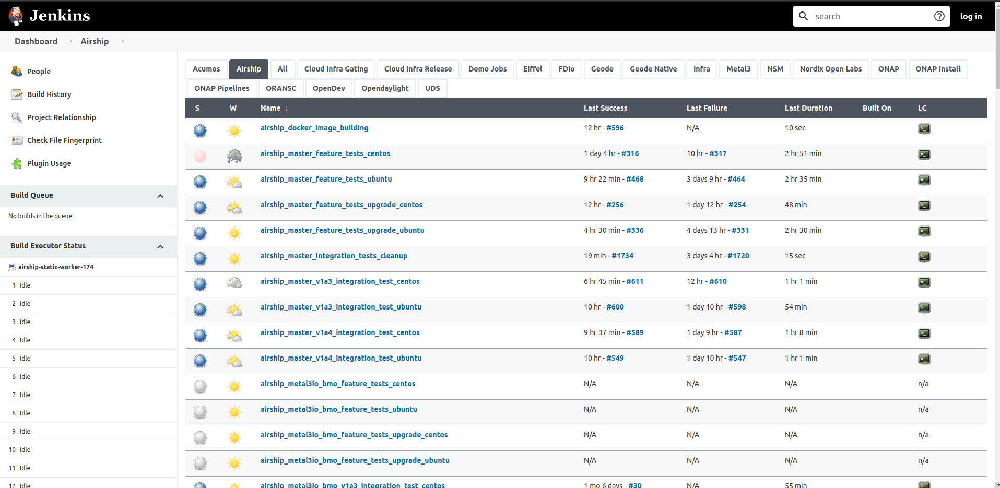
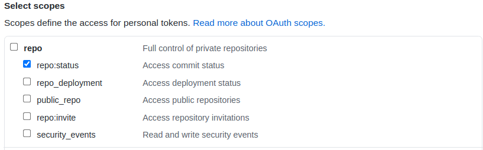

# Nordix Jenkins CI

Integration tests are running in the [Nordix](https://www.nordix.org)
infrastructure. Nordix provides a
[Jenkins](https://jenkins.nordix.org/view/Airship/) instance and cloud resources
on [CityCloud](https://www.citycloud.com/) for the Airship project. We use those
resources to run integration tests for Metal3.

## Admins whitelist

All members of the metal3-io organization that set their membership to be
publicly visible will get admin rights on the CI jobs. This means :

* They can start the jobs on their PR directly
* They can start the jobs for PR of authors that are not in the organization
* They can add authors to whitelist so that the authors can start jobs on any
   further PR on their own, by commenting **add to whitelist** on the PR

## Commands

We have multiple jobs that run some integration tests. The jobs can be
triggered on PR from metal3-dev-env, baremetal-operator, ironic-image, ip-address-manager
and cluster-api-provider-metal3 repositories by commenting the commands below.
The job result will be posted as a comment.

* **/test-integration** run integration tests for v1alpha5 on Ubuntu
* **/test-centos-integration** run integration tests for v1alpha5 on
   CentOS
* **/test-v1a4-integration** run integration tests for v1alpha4 on Ubuntu
* **/test-v1a4-centos-integration** run integration tests for v1alpha4 on
   CentOS

It is also possible to prevent any job run by adding **/skip-test** in the PR
description.

If the author is not in the whitelist but should be trusted then by adding a
comment **add to whitelist** on the PR, the author will then be able to run the
jobs on its own.

## Cloud Resources cleanup

There is a Jenkins [master job](https://jenkins.nordix.org/view/Airship/job/airship_master_integration_tests_cleanup/)
that cleans up all the leftover VMs from
[CityCloud](https://www.citycloud.com/) every 6 hours which has failed to be
deleted at the end of v1alphaX integration test.

## "Can one of the admins verify this patch?"

For all the PRs from authors that are not whitelisted, the bot will add a
comment "*Can one of the admins verify this patch?*". This means that the author
is not in the whitelist and that someone from the metal3-io organization should
review the PR and run the tests (with */test-integration*) or add the author to
whitelist if trusted.

## Job logs

Pods, CRDs logs are collected at the end of each Jenkins job run and
archived so that they can be later used for debugging purposes. You can
find the archived logs under the  "*Build artifacts*" section of the
[job](https://jenkins.nordix.org/view/Airship/job/airship_metal3io_bmo_v1a4_integration_test_ubuntu/).
Please note that the logs will be removed 30 days after creation or after 100 subsequent job runs,
whichever occurs first.

## Configuration

The jenkins configuration is stored in two places. The Nordix gerrit instance
contains the jenkins job configuration and the Github metal3-io/project-infra
repository contains the jobs pipeline.

### Jenkins Job Builder, a.k.a. job definition

We use [Jenkins Job Builder](https://docs.openstack.org/infra/jenkins-job-builder/index.html) (JJB) to
write Jenkins job definitions in YAML format. It helps us to keep job definitions in source control
rather than writing/creating them directly in Jenkins UI. Your YAML formatted job definition
will create a Jenkins job, which in turn executes your specified jenkins pipeline.
Check [Job definitions](https://docs.openstack.org/infra/jenkins-job-builder/definition.html) to
familiarize yourself with the JJB syntax. Our job definitions are stored in [Nordix Gerrit](https://gerrit.nordix.org/admin/repos/infra/cicd)
instance under `cicd/jjb/airship/` path. Please, note that [cicd](https://gerrit.nordix.org/admin/repos/infra/cicd)
gerrit repository includes job defitinions for other projects as well that share the same Jenkins environment.

When you add/remove a new job definition in `cicd/jjb/airship/` path, you will be able to see that job
added/removed in Jenkins UI under [airship window](https://jenkins.nordix.org/view/Airship/).

### Job Declarative Pipeline

We use [declarative pipeline syntax](https://www.jenkins.io/doc/book/pipeline/syntax/) to tell what we want to do
when Jenkins executes our pipeline. Pipelines are stored in [metal3-io/project-infra](https://github.com/metal3-io/project-infra/tree/master/jenkins/jobs) repository.
In a nutshell, pipelines defines sequence of steps to be executed. Each step can run a script or perform something else. For example, [integration_tests.pipeline](https://github.com/metal3-io/project-infra/blob/master/jenkins/jobs/integration_tests.pipeline) executes following scripts

1. [clones](https://github.com/metal3-io/project-infra/blob/0a6cc3f9f8592914a316c27ea2411ccb48aba7c3/jenkins/jobs/integration_tests.pipeline#L65) git repository
2. [jenkins/scripts/integration_test.sh](https://github.com/metal3-io/project-infra/blob/master/jenkins/scripts/integration_test.sh)
3. [jenkins/scripts/fetch_logs.sh](https://github.com/metal3-io/project-infra/blob/master/jenkins/scripts/fetch_logs.sh)
4. [jenkins/scripts/integration_test_clean.sh](https://github.com/metal3-io/project-infra/blob/master/jenkins/scripts/integration_test_clean.sh)
5. [jenkins/scripts/integration_delete.sh](https://github.com/metal3-io/project-infra/blob/master/jenkins/scripts/integration_delete.sh)

### GitHub Pull Request Builder, a.k.a. ghprb

For our Jenkins to work with GitHub we need [GitHub Pull Request Builder](https://plugins.jenkins.io/ghprb/), a.k.a. ghprb plugin installed in Jenkins. This is already done by Nordix admins. The plugin handles everything related to your PR. In short, ghprb exposes a webhook endpoint where GutHub webhook service can send webhook calls to. Current Jenkins ghprb webhook is exposed at https://jenkins.nordix.org/ghprbhook/, and most of the Metal3 GitHub repositories have webhooks configured to redirect webhook calls to that URL.
When configuring GitHub webhooks: 

1. Paste the ghprb URL in **Payload URL**;

1. select application/json for the **Content Type**;

1. check the following scopes for **Which events would you like to trigger this webhook?**;

   - `Issue comments`
   - `Pull requests`

We use [metal3-jenkins](https://github.com/metal3-jenkins) GitHub bot account which reports
job status on a pull request. The bot is a public member of Metal3 GitHub org. To use this bot
with Jenkins ghprb, a GitHub personal access token was generated with the following scope checked:

To use the token in Jenkins, `metal3-jenkins-github-token` secret is created in Jenkins credentials.
See the usage [reference](https://github.com/metal3-io/project-infra/blob/12660dd59d368c86e471007d86ca781cf2539ec9/jenkins/jobs/integration_tests.pipeline#L3).

You can see ghprb logs in [here](https://jenkins.nordix.org/log/GHPRB/) only if you have admin rights in the Nordix Jenkins.

Sometimes, when changing the credentials related to ghprb, the system might still be using the old credentials. If you see that your changes aren't
taking affect, you could try to clean up the ghprb cache in Jenkins.

### Some other secrets in Jenkins

- `metal3-jenkins-github-username-token` - stores the username of the metal3-jenkins GitHub bot account.
   Used by Jenkins Job Builders.

- `metal3-clusterctl-github-token` - stores a GitHub token for use in Metal3
   integration tests with no permissions. This is to avoid GitHub API limitations for unauthenticated
   users. Used by [pipeline](https://github.com/metal3-io/project-infra/blob/12660dd59d368c86e471007d86ca781cf2539ec9/jenkins/jobs/integration_tests.pipeline#L88).

Sometimes, your changes might not take effect and you need to flash out Jenkins cache.

### Job image

We use a volume and pre-baked image (for Ubuntu and Centos, respectively) to run
the integration tests.

* There is a Jenkins job that builds the base Ubuntu volume
every night which will include pre-executed script for installing metal3
requirements. The base volume then will be cloned and attached to the VM which
will be running integration tests. The volume building script for Ubuntu can be
found [here](https://github.com/Nordix/airship-dev-tools/blob/master/ci/images/gen_metal3_ubuntu_volume.sh).
* Pre-baked image is used to speed up the integrations tests which comes with
pre-baked Kubernetes executables. The image building script for CentOS can be
found [here](https://github.com/Nordix/airship-dev-tools/blob/master/ci/images/gen_metal3_centos_image.sh).

## Contact

In case of issues or question on the Jenkins CI, please contact the maintainers
by email to estjorvas [at] est.tech or by posting your message on the
[\#cluster-api-baremetal](https://kubernetes.slack.com/messages/CHD49TLE7) channel
on Kubernetes Slack.