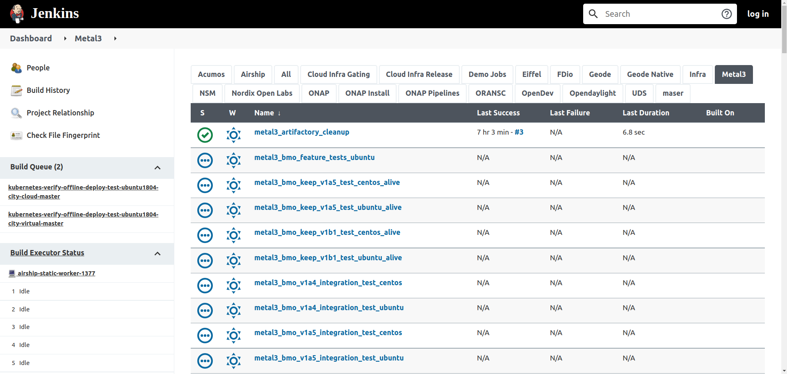
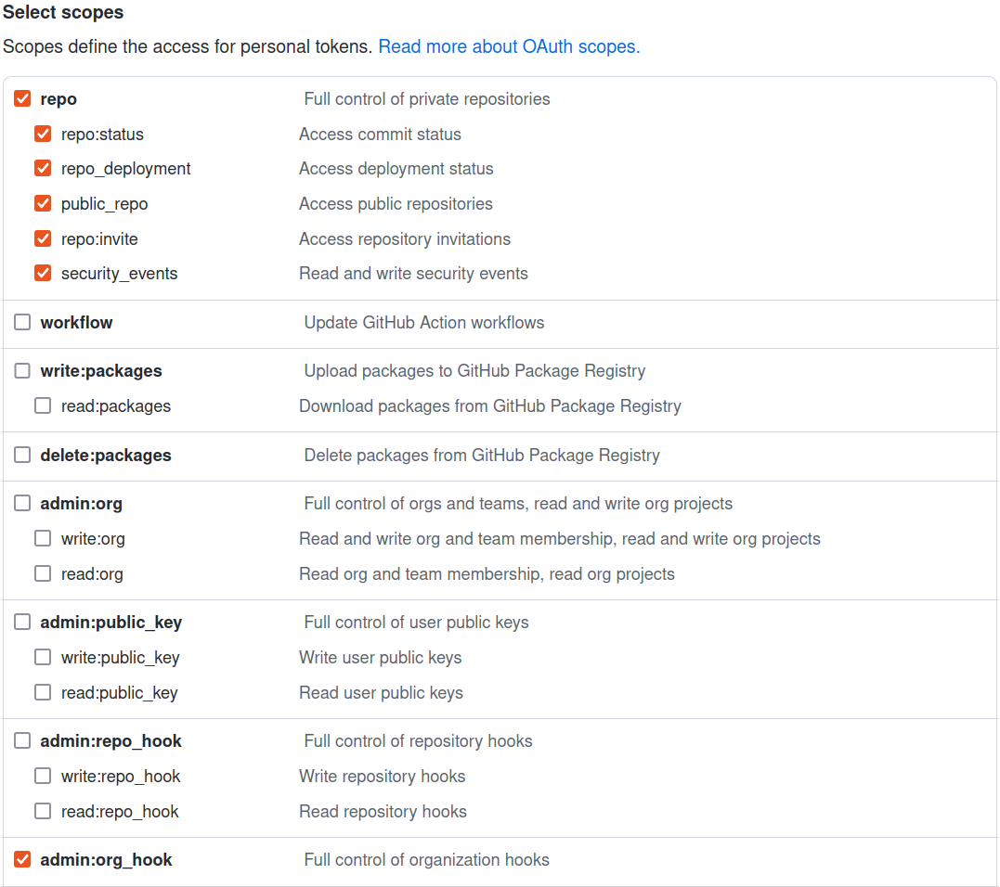

# Nordix Jenkins CI

Integration tests are running in the [Nordix](https://www.nordix.org)
infrastructure. Nordix provides a
[Jenkins](https://jenkins.nordix.org/view/Metal3/) instance and cloud resources
on [CityCloud](https://www.citycloud.com/) for the Metal3 project. We use those
resources to run integration tests for Metal3.

## Admins whitelist

All members of the metal3-io organization that set their membership to be
publicly visible will get admin rights on the CI jobs. This means:

* They can start the jobs on their PR directly
* They can start the jobs for PR of authors that are not in the organization
* They can add authors to whitelist (by commenting **/ok-to-test** on the PR) so
  that the authors can start jobs on their PR themselves

## Jenkins commands

We have multiple jobs that run some integration tests. The jobs can be
triggered on PR from metal3-dev-env, baremetal-operator, ironic-image,
ip-address-manager and cluster-api-provider-metal3 repositories by commenting
the commands below. The job result will be posted as a comment.

* **/test-ubuntu-integration-main** run integration tests with CAPM3 API version
  v1beta1 and branch main on Ubuntu
* **/test-centos-integration-main** run integration tests with CAPM3 API version
  v1beta1 and branch main on CentOS
* **/test-ubuntu-integration-release-1-8** run integration tests with CAPM3 API
  version v1beta1 and branch release-1.8 on Ubuntu
* **/test-centos-integration-release-1-8** run integration tests with CAPM3 API
  version v1beta1 and branch release-1.8 on CentOS
* **/test-ubuntu-integration-release-1-7** run integration tests with CAPM3 API
  version v1beta1 and branch release-1.7 on Ubuntu
* **/test-centos-integration-release-1-7** run integration tests with CAPM3 API
  version v1beta1 and branch release-1.7 on CentOS
* **/test-ubuntu-integration-release-1-6** run integration tests with CAPM3 API
  version v1beta1 and branch release-1.6 on Ubuntu
* **/test-centos-integration-release-1-6** run integration tests with CAPM3 API
  version v1beta1 and branch release-1.6 on CentOS
* **/test-ubuntu-integration-release-1-5** run integration tests with CAPM3 API
  version v1beta1 and branch release-1.5 on Ubuntu
* **/test-centos-integration-release-1-5** run integration tests with CAPM3 API
  version v1beta1 and branch release-1.5 on CentOS

### E2E tests

E2E tests are gradually replacing the previous Ansible tests for more details
about e2e triggers please check:
<https://github.com/metal3-io/cluster-api-provider-metal3#e2e-test>

## Prow commands

There are some plugins supported by prow and makes the life of the developer
easier in certain cases:

1. `cherry-pick` plugin can be used for cherrypicking PRs across branches by
   commenting:
   * **/cherry-pick release-x.y** where `release-x.y` is any supported release
     branch, where the backport PR will be opened by the
     [cherry picker bot](https://github.com/metal3-cherrypick-bot).
1. `transfer-issue` plugin can be used for transferring issues across
   repositories in the same GitHub organization by commenting:
   * **/transfer-issue target-repo-name** on the issue. One simple example
     could be transferring the issue from cluster-api-provider-metal3 to
     ip-address-manager repository. This can be archived by using:
     **/transfer-issue ip-address-manager**.

**Note:** Please remember to manually create a corresponding branch in
cherry-pick bot's forked repositories (CAPM3, IPAM) in case a new release branch
(i.e. release-1.5) is created upstream. That is because when the bot is used to
backport the patches to the new release branch, it has to track the new upstream
branch to be able to open a PR against it in the future.

## Cloud Resources cleanup

There is a Jenkins
[main job](https://jenkins.nordix.org/view/Metal3%20Periodic/job/metal3_daily_main_integration_tests_cleanup/)
that cleans up all the leftover VMs from [CityCloud](https://www.citycloud.com/)
every 6 hours which has failed to be deleted at the end of v1alphaX/v1betaX
integration tests.

## "I'm waiting for metal3-io member to verify this patch is reasonable to test"

For all the PRs from authors that are not whitelisted, the bot will add a
comment "*I'm waiting for a metal3-io member to verify that this patch is
reasonable to test*". This means that the author is not in the whitelist and
that someone from the metal3-io organization should review the PR and run the
required tests suggested by the Github or add the author to whitelist if
trusted.

## Job logs

Pods, CRDs logs are collected at the end of each Jenkins job run and
archived so that they can be later used for debugging purposes. You can
find the archived logs under the  "*Build artifacts*" section of the
[job](https://jenkins.nordix.org/view/Metal3/job/metal3_bmo_main_integration_test_ubuntu/).
Please note that the logs will be removed 30 days after creation or after 100
subsequent job runs, whichever occurs first.

## Configuration

The jenkins configuration is stored in two places. The Nordix gerrit instance
contains the jenkins job configuration and the Github metal3-io/project-infra
repository contains the jobs pipeline.

### Jenkins Job Builder, a.k.a. job definition

We use
[Jenkins Job Builder](https://docs.openstack.org/infra/jenkins-job-builder/attic/index.html)
(JJB) to write Jenkins job definitions in YAML format. It helps us to keep job
definitions in source control rather than writing/creating them directly in
Jenkins UI. Your YAML formatted job definition will create a Jenkins job, which
in turn executes your specified jenkins pipeline. Check
[Job definitions](https://docs.openstack.org/infra/jenkins-job-builder/attic/definition.html)
to familiarize yourself with the JJB syntax. Our job definitions are stored in
[Nordix Gerrit](https://gerrit.nordix.org/admin/repos/infra/cicd) instance under
`cicd/jjb/metal3/` path. Please, note that
[cicd](https://gerrit.nordix.org/admin/repos/infra/cicd)
gerrit repository includes job defitinions for other projects as well that share
the same Jenkins environment.

When you add/remove a new job definition in `cicd/jjb/metal3/` path, you will
be able to see that job added/removed in Jenkins UI under the
[Metal3 view](https://jenkins.nordix.org/view/Metal3/).

### Job Declarative Pipeline

We use
[declarative pipeline syntax](https://www.jenkins.io/doc/book/pipeline/syntax/)
to tell what we want to do when Jenkins executes our pipeline. Pipelines are
stored in
[metal3-io/project-infra](https://github.com/metal3-io/project-infra/tree/main/jenkins/jobs)
repository. In a nutshell, pipelines defines sequence of steps to be executed.
Each step can run a script or perform something else. For example,
[integration_tests.pipeline](https://github.com/metal3-io/project-infra/blob/main/jenkins/jobs/integration_tests.pipeline)
executes following scripts:

1. [clones](https://github.com/metal3-io/project-infra/blob/0a6cc3f9f8592914a316c27ea2411ccb48aba7c3/jenkins/jobs/integration_tests.pipeline#L65)
   git repository
1. [jenkins/scripts/integration_test.sh](https://github.com/metal3-io/project-infra/blob/main/jenkins/scripts/integration_test.sh)
1. [jenkins/scripts/fetch_logs.sh](https://github.com/metal3-io/project-infra/blob/main/jenkins/scripts/fetch_logs.sh)
1. [jenkins/scripts/integration_test_clean.sh](https://github.com/metal3-io/project-infra/blob/main/jenkins/scripts/integration_test_clean.sh)
1. [jenkins/scripts/integration_delete.sh](https://github.com/metal3-io/project-infra/blob/main/jenkins/scripts/integration_delete.sh)

### GitHub Pull Request Builder, a.k.a. ghprb

For our Jenkins to work with GitHub we need
[GitHub Pull Request Builder](https://plugins.jenkins.io/ghprb/), a.k.a. ghprb
plugin installed in Jenkins. This is already done by Nordix admins. The plugin
handles everything related to your PR. In short, ghprb exposes a webhook
endpoint where GutHub webhook service can send webhook calls to. Current Jenkins
ghprb webhook is exposed at <https://jenkins.nordix.org/ghprbhook/>, and most
of the Metal3 GitHub repositories have webhooks configured to redirect webhook
calls to that URL. When configuring GitHub webhooks:

1. Paste the ghprb URL in **Payload URL**;
1. select application/json for the **Content Type**;
1. check the following scopes for **Which events would you like to trigger this webhook?**;
   * `Issue comments`
   * `Pull requests`

We use [metal3-jenkins](https://github.com/metal3-jenkins) GitHub bot account
which reports job status on a pull request. The bot is a public member of Metal3
GitHub org. To use this bot with Jenkins ghprb, a GitHub personal access token
was generated with the following scopes checked:

To use the token in Jenkins, `metal3-jenkins-github-token` secret is created
in Jenkins credentials. See the usage
[reference](https://github.com/metal3-io/project-infra/blob/12660dd59d368c86e471007d86ca781cf2539ec9/jenkins/jobs/integration_tests.pipeline#L3).

You can see ghprb logs in [here](https://jenkins.nordix.org/log/GHPRB/) only if
you have admin rights in the Nordix Jenkins.

Sometimes, when changing the credentials related to ghprb, the system might
still be using the old credentials. If you see that your changes aren't
taking affect, you could try to clean up the ghprb cache in Jenkins.

### Some other secrets in Jenkins

* `metal3-jenkins-github-username-token` stores the username of the
   metal3-jenkins GitHub bot account. Used by Jenkins Job Builders.
* `metal3-clusterctl-github-token` stores a GitHub token for use in Metal3
   integration tests with no permissions. This is to avoid GitHub API
   limitations for unauthenticated users. Used by
   [pipeline](https://github.com/metal3-io/project-infra/blob/12660dd59d368c86e471007d86ca781cf2539ec9/jenkins/jobs/integration_tests.pipeline#L88).

Sometimes, your changes might not take effect and you need to flash out Jenkins
cache.

### Job image

We use raw images backed from Ceph in CityCloud to run all the jobs (nightly
builds, on pull requests) in CI.

## Contact

In case of issues or question on the Jenkins CI, please contact the maintainers
by email to estjorvas \[at\] est.tech or by posting your message on the
[\#cluster-api-baremetal](https://kubernetes.slack.com/messages/CHD49TLE7)
channel on Kubernetes Slack.
