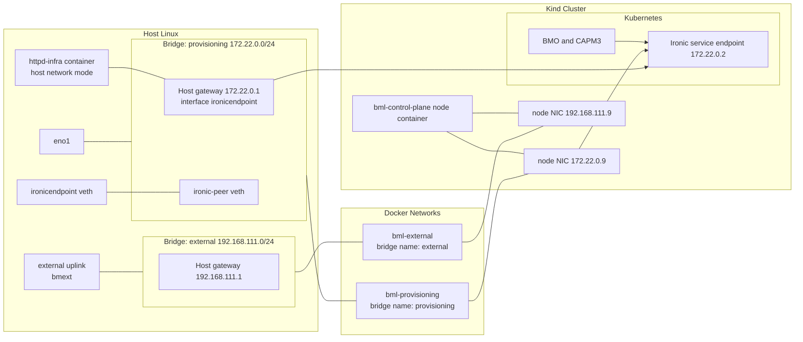
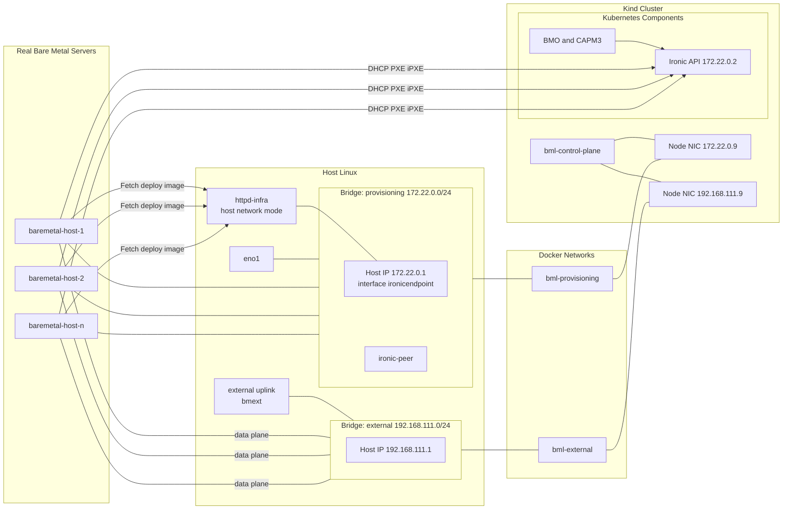
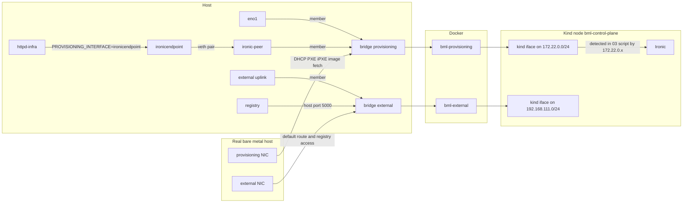

# Kind Networking Topology for BML

This diagram visualizes the kind-based networking used by the BML flow.

Current model: Docker networks + Linux bridges only. This path does not use
libvirt network definitions.

External uplink behavior is now explicit:

- by default, `external` bridge uses `EXTERNAL_IFACE` (default `bmext`)

Host egress for the external subnet is also enforced by the host setup script:

- validates `192.168.111.1/24` is bound on bridge `external`
- requires `net.ipv4.ip_forward=1` on the host
- installs idempotent `iptables` NAT/FORWARD rules for `192.168.111.0/24`

## Connectivity Summary

- Provisioning plane:
   - kind node NIC 172.22.0.9 is attached to the provisioning bridge domain.
   - Ironic endpoint 172.22.0.2 is reachable from cluster components over
     this network.
- External plane:
   - kind node NIC 192.168.111.9 is attached to the external bridge domain.
   - provisioned bare-metal hosts use 192.168.111.1 as their external
     gateway.
   - by default, external traffic uses uplink `bmext`.
- Image serving:
   - httpd-infra serves deployment images through the provisioning side.
   - the local bootstrap registry is published on host port 5000 and is
     reachable as 192.168.111.1:5000 from the external subnet.
- DNS for provisioned nodes:
   - manifests use `${EXTERNAL_DNS_V4}` (rendered in `run-test.yaml`) instead
     of a fixed resolver.

## Topology Including Real Bare Metal Hosts

### Bare Metal Flow Notes

- Provisioning traffic (DHCP, iPXE, IPA image fetch) stays on
  `provisioning` bridge.
- Real hosts download deploy artifacts from `httpd-infra` via `172.22.0.1`.
- Ironic API and provisioning services are reached through the same
  provisioning domain.

## Interface-Level Communication Paths

### Interface Mapping

- Host to provisioning plane:
   - `eno1` is attached to `provisioning` bridge.
   - `ironicendpoint` and `ironic-peer` connect the host network stack to the
     same provisioning bridge.
- Host image serving:
   - `httpd-infra` uses host networking and serves images via
     `ironicendpoint`.
- Host local registry:
   - `registry` is exposed on host port `5000` and is reachable from the
     external subnet via `192.168.111.1:5000`.
- Host external uplink:
   - `external` bridge member is selected by `resolve_external_iface`.
   - default path is `EXTERNAL_IFACE` (default `bmext`).
- Host egress enforcement:
   - host setup enables IPv4 forwarding and adds NAT/FORWARD rules for
     `192.168.111.0/24` toward the host default route interface.
- Kind node to provisioning plane:
   - the node interface on `172.22.0.0/24` is discovered dynamically and used
     as the Ironic provisioning interface.
- Kind node to external plane:
   - the node interface on `192.168.111.0/24` carries external network access.
- Bare metal host paths:
   - the provisioning NIC reaches DHCP, iPXE, Ironic, and image-serving over
     the `provisioning` bridge.
   - the external NIC carries the default route and access toward
     `192.168.111.1:5000`.
