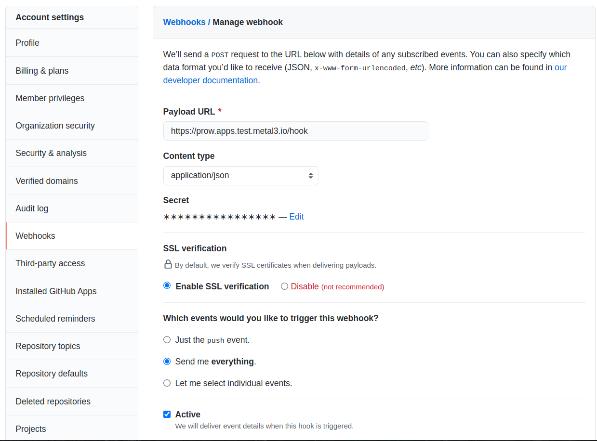
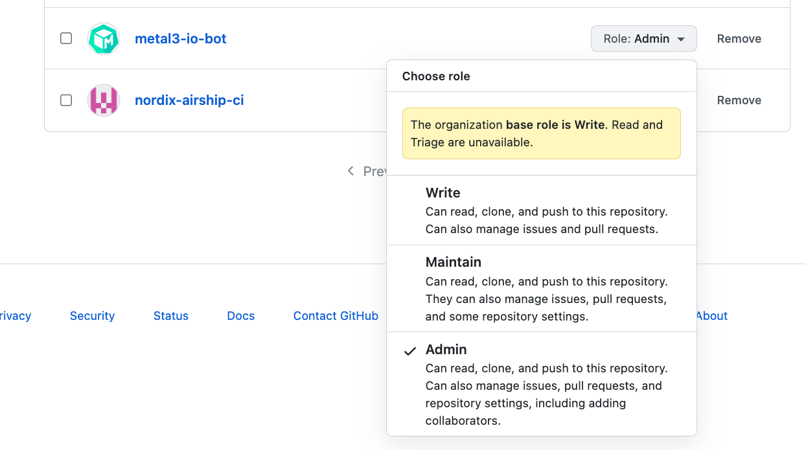
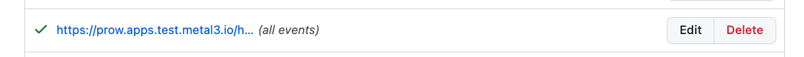

# Prow

<!-- cSpell:ignore openstackcluster -->

Metal3 Prow dashboard: <https://prow.apps.test.metal3.io>

## Prow config and jobs

The configuration files for prow are in the `config` directory. The prow jobs
have been split out into multiple files to make managing them easier. They can
be found under `config/jobs`. They are all collected into a ConfigMap
`job-config` that prow can access.

The jobs are sorted based on github organization and repository. For
repositories with release branches, we keep one file per branch. This way it is
easy to add tests for a new branch by copying an existing file, and removing
tests for a branch by just deleting the corresponding file.

## Access Controls

- To merge, patches must have `/approve` and `/lgtm`, which apply the `approved`
  and `lgtm` labels. For repositories in the Nordix organization, two approving
  reviews are also needed to avoid accidental merges when an approver puts
  `lgtm` and approves (which adds `approved`) in one review.
- The use of `/approve` and `/lgtm` is controlled by the `OWNERS` file in each
  repository. See the [OWNERS spec](https://go.k8s.io/owners) for more details
  about how to manage access to all or part of a repo with this file.
- Tests will run automatically for PRs authored by **public** members of the
  `metal3-io` GitHub organization. Members of the GitHub org can run
  `/ok-to-test` for PRs authored by those not in the GitHub org.

See the [Prow command help](https://prow.apps.test.metal3.io/command-help) for
more information about who can run each prow command.

## About the Metal3 Prow instance

Prow is deployed in a Kubernetes cluster in Xerces. The cluster is created using
the Cluster API provider for OpenStack (CAPO), using the configuration in
`capo-cluster`. You will need access to (or be able to create) the following
credentials in order to deploy or manage the Kubernetes cluster and the Prow
instance:

1. OpenStack credentials, used by CAPO to manage the OpenStack resources.
1. S3 credentials (can be created using the OpenStack API).
1. A HMAC token for webhook validation.
1. A GitHub token for accessing GitHub.
1. A separate GitHub token for the cherry-pick bot.
1. A token and username for accessing Jenkins, when triggering Jenkins jobs from
   Prow.

In addition to this, we rely on a GitHub bot account
([metal3-io-bot](https://github.com/metal3-io-bot), owner of the GitHub token)
and a separate GitHub bot
[metal3-cherrypick-bot](https://github.com/metal3-cherrypick-bot), for cherry
picking pull requests. A webhook must be configured in GitHub to send events to
Prow and a DNS record must be configured so that
<https://prow.apps.test.metal3.io> points to the IP where Prow can be accessed.

The DNS records are managed by CNCF for us. Any changes to them can be done
through the
[service desk](https://cncfservicedesk.atlassian.net/servicedesk/customer/portals).
All project maintainers have (or can request) access. See
[their FAQ](https://github.com/cncf/servicedesk#how-do-i-file-a-ticket-with-the-service-desk)
for more details.

### Requirements

You will need the following CLI tools in order to deploy and/or manage Prow:

- [clusterctl](https://cluster-api.sigs.k8s.io/user/quick-start.html#install-clusterctl)
- [kubectl](https://kubernetes.io/docs/tasks/tools/#kubectl)
- [kind](https://kind.sigs.k8s.io/)
- [openstack](https://docs.openstack.org/newton/user-guide/common/cli-install-openstack-command-line-clients.html),
  can be installed directly from Ubuntu repositories.
- [s3cmd](https://s3tools.org/s3cmd), can be installed directly from Ubuntu
  repositories.

### Folders and components

There are five folders with kustomizations (`capi`, `capo-cluster`,
`cluster-resources`, `infra` and `manifests`). The `capi` folder contains a
kustomization for cert-manager, the cluster API operator as well as the provider
components we use. The `capo-cluster` folder contains everything needed for
creating the Kubernetes cluster itself. In `cluster-resources`, you will find
things the cluster needs to integrate with the cloud, i.e. the external
cloud-provider for OpenStack and CSI plugin for Cinder. It also has the CNI
(Calico), since that is needed to get a healthy cluster and the cluster
autoscaler. The `infra` folder contains "optional" add-ons and configuration
e.g. an ingress controller, a ClusterIssuer for getting Let's Encrypt
certificates and a LoadBalancer Service for ingress and a StorageClass for
Cinder volumes.

The deployment manifests for Prow (`manifests`) are based on the
[getting started guide](https://docs.prow.k8s.io/docs/getting-started-deploy/)
and the
[starter-s3.yaml](https://github.com/kubernetes/test-infra/blob/master/config/prow/cluster/starter/starter-s3.yaml)
manifests. They have been separated out into multiple files and tied together
using kustomizations. This makes it easy to keep secrets outside of git while
still allowing for simple one-liners for applying all of it.

The getting started guide is (as of writing) focused on setting up Prow using a
GitHub app, but Prow actually supports
[many authentication methods](https://github.com/kubernetes/test-infra/blob/441b5000ef79491d08bd5f393de8f69650b85355/prow/flagutil/github.go#L137).
We use API tokens created from GitHub bot accounts.

We use [ingress-nginx](https://kubernetes.github.io/ingress-nginx/) as ingress
controller. It is fronted by a LoadBalancer Service, i.e. a loadbalancer in
Xerces. The Service is configured to grab the correct IP automatically and to
avoid deleting it even if the Service is deleted. See
[infra/service.yaml](infra/service.yaml). For securing it with TLS we rely on
[cert-manager](https://cert-manager.io/) and the Let's Encrypt HTTP01 challenge,
as seen in [infra/cluster-issuer-http.yaml](infra/cluster-issuer-http.yaml).

#### Monitoring

Please see [infra/kube-prometheus](infra/kube-prometheus).

## Building node images

The Kubernetes cluster where Prow runs needs pre-built images for the Nodes. We
use [image-builder](https://github.com/kubernetes-sigs/image-builder) for this.

Here is how to build a node image directly in Xerces. See the
[image-builder book](https://image-builder.sigs.k8s.io/capi/providers/openstack-remote.html)
for more details. Start by creating a JSON file with relevant parameters for the
image. Here is an example:

```json
{
  "source_image": "54f49763-5f17-475e-9ad2-67dc8cd9a9ff",
  "networks": "29fd620e-8145-43a2-8140-5cec6a69f344",
  "flavor": "c4m4",
  "floating_ip_network": "internet",
  "ssh_username": "ubuntu",
  "volume_type": "",
  "kubernetes_deb_version": "1.30.6-1.1",
  "kubernetes_rpm_version": "1.30.6",
  "kubernetes_semver": "v1.30.6",
  "kubernetes_series": "v1.30"
}
```

Then build the image like this:

```bash
cd images/capi
PACKER_VAR_FILES=var_file.json make build-openstack-ubuntu-2204
```

## Create credentials

1. Create application credentials for use by the OpenStack cloud provider.

   ```bash
   # Note! If the user that created the credentials is removed,
   # so is the application credentials!
   openstack application credential create prow-capo-cloud-controller
   ```

   The output of this command should give you an application credential ID and
   secret. Store them in a safe place. In the rest of this document they will be
   referred to as `${APP_CRED_ID}` and `${APP_CRED_SECRET}`.

1. Set up S3 object storage.

   ```bash
   openstack --os-interface public ec2 credentials create
   ```

   Store the access key and secret key in a safe place. They will be needed also
   for deploying prow. They will be referred to as `${S3_ACCESS_KEY}` and
   `${S3_SECRET_KEY}`.

1. Generate HMAC token.

   ```shell
   openssl rand -hex 20
   ```

   It will be referred to as `${HMAC_TOKEN}`.

1. Create a Jenkins token by logging in to Jenkins using the
   [metal3.bot@gmail.com](mailto:metal3.bot@gmail.com) account and adding an API
   token in the "Configure" tab for the user. It will be referred to as
   `${JENKINS_TOKEN}`.

## GitHub configuration

1. Create bot accounts. The bot accounts are normal accounts on GitHub. Both of
   them have Gmail accounts connected to the GitHub accounts.

1. Create a personal access token for the GitHub bot account. This should be
   done from the [metal3-io-bot](https://github.com/metal3-io-bot) GitHub bot
   account. You can follow this [link](https://github.com/settings/tokens) to
   create the token. When generating the token, make sure you have only the
   following scopes checked in.

   - `repo` scope for full control of all repositories
   - `workflow`
   - `admin:org_hook` for a GitHub org

   The token will be referred to as `${GITHUB_TOKEN}`.

1. Create a personal access token for the cherry-picker bot. This should be done
   from the [metal3-io-bot](https://github.com/metal3-io-bot)
   GitHub bot account. You can follow this
   [link](https://github.com/settings/tokens) to create the token. When
   generating the token, make sure you have only the following scopes checked
   in.

   - `repo`
   - `workflow`
   - `admin:org/read:org` (not all of admin:org, just the sub-item read:org)

   The token will be referred to as `${CHERRYPICK_TOKEN}`.

1. Create a GitHub webhook for <https://prow.apps.test.metal3.io/hook> using the
   HMAC token generated earlier. Add the URL and token as below. Select **"Send
   me everything"**, and for Content type: **application/json**.

   

## Generate secret files

Files with credentials and other sensitive information are not stored in this
repository. You will need to add them manually before you can apply any
manifests and build the kustomizations. CAPO needs access to the OpenStack API
and so does the external cloud-provider. Prow needs a GitHub token for accessing
GitHub, a HMAC token for validating webhook requests, and S3 credentials for
storing logs and similar.

If you are deploying from scratch or rotating credentials, please make sure to
save them in a secure place after creating them. If there is an existing
instance, you most likely just have to take the credentials from the secure
place and generate the files below from them.

Please set the following environment variables with the relevant credentials.
Then you will be able to just copy and paste the snippets below.

- `APP_CRED_ID`
- `APP_CRED_SECRET`
- `S3_ACCESS_KEY`
- `S3_SECRET_KEY`
- `HMAC_TOKEN`
- `GITHUB_TOKEN`
- `CHERRYPICK_TOKEN`
- `JENKINS_TOKEN`

Now you are ready to create the files.

1. Create `clouds.yaml` secret used by the CAPO controllers to manage the
   infrastructure.

   ```bash
   cat > capo-cluster/clouds.yaml <<EOF
   clouds:
      prow:
         auth:
            auth_url: https://xerces.ericsson.net:5000
            auth_type: v3applicationcredential
            application_credential_id: ${APP_CRED_ID}
            application_credential_secret: ${APP_CRED_SECRET}
            user_domain_name: xerces
            project_name: EST_Metal3_CI
            project_id: 51faa3170dfc4990b6654346c2bf2243
         region_name: RegionOne
   EOF
   ```

1. Create `cloud.conf` secret for the cloud provider integration.

   ```bash
   cat > cluster-resources/cloud.conf <<EOF
   [Global]
   auth-url=https://xerces.ericsson.net:5000
   application-credential-id=${APP_CRED_ID}
   application-credential-secret=${APP_CRED_SECRET}
   region=RegionOne
   project-name=EST_Metal3_CI
   project-id=51faa3170dfc4990b6654346c2bf2243
   EOF
   ```

1. Get the kubeconfig and save it as `capo-cluster/kubeconfig.yaml`.

1. Create S3 credentials secret.

   ```bash
   # Create service-account.json
   cat > manifests/overlays/metal3/service-account.json <<EOF
   {
      "region": "RegionOne",
      "access_key": "${S3_ACCESS_KEY}",
      "endpoint": "https://xerces.ericsson.net:7480",
      "insecure": false,
      "s3_force_path_style": true,
      "secret_key": "${S3_SECRET_KEY}"
   }
   EOF
   ```

1. Create configuration file for `s3cmd`. This is used for creating the buckets.
   The command will create the file `.s3cfg`.

   ```bash
   s3cmd --config .s3cfg --configure
   # Provide Access key and Secret key from the openstack credentials created above.
   # Leave Default Region as US.
   # Set S3 Endpoint xerces.ericsson.net:7480
   # Set DNS-style bucket+hostname:port template to the same xerces.ericsson.net:7480
   # Default values for the rest. And save settings.
   ```

1. Save the HMAC token as `manifests/overlays/metal3/hmac-token`.

   ```bash
   echo "${HMAC_TOKEN}" > manifests/overlays/metal3/hmac-token
   ```

1. Save the metal3-io-bot token as `manifests/overlays/metal3/github-token`.

   ```bash
   echo "${GITHUB_TOKEN}" > manifests/overlays/metal3/github-token
   ```

1. Save the metal3-cherrypick-bot token as
   `manifests/overlays/metal3/cherrypick-bot-github-token`.

   ```bash
   echo "${CHERRYPICK_TOKEN}" > manifests/overlays/metal3/cherrypick-bot-github-token
   ```

1. Save the Jenkins token as `manifests/overlays/metal3/jenkins-token`.

   ```bash
   echo "${JENKINS_TOKEN}" > manifests/overlays/metal3/jenkins-token
   ```

## Access existing instance

For accessing an existing instance, you can simply get the relevant credentials
and files from the password manager and put them in the correct places (see the
section for generating secret files). Check the IP of the bastion in xerces and
set it in the environment variable `BASTION_FLOATING_IP`. After this you just
need to set up a proxy for accessing the API through the bastion:

```bash
   ssh -N -D 127.0.0.1:6443 "ubuntu@${BASTION_FLOATING_IP}"
```

The above command will just "hang". That is expected, since it is just
forwarding the traffic.

In another terminal you should now be able to use `kubectl` to access the
cluster:

```bash
   export KUBECONFIG=capo-cluster/kubeconfig.yaml
   kubectl get nodes
```

## Deploying Prow from scratch

When deploying completely from scratch, you will need to first create the
necessary GitHub bot accounts and webhook configuration. In addition, you need
to create the credentials, generate secret files from them, and build node
images (see sections above).
You may also have to create a keypair with the Metal3 CI ssh key.

1. Create a bootstrap cluster (kind).

   ```bash
   kind create cluster
   kubectl apply -k capi
   # NOTE! You WILL need to apply multiple times before it is successful.
   # This is because CRDs and webhooks must be in place before other
   # resources can be added.
   ```

1. Create cluster.

   ```bash
   kubectl apply -k capo-cluster
   ```

1. Temporarily allow access from your public IP so that CAPI can access the
   cluster. See the section below about updating the bastion for more details.

   ```bash
   # Check public IP
   curl -s ifconfig.me
   # Add it to spec.apiServerLoadBalancer.allowedCIDRs
   kubectl edit openstackcluster prow
   ```

1. Get kubeconfig and set up proxy for accessing API through the bastion.

   ```bash
   BASTION_FLOATING_IP="$(kubectl get openstackcluster prow -o jsonpath="{.status.bastion.floatingIP}")"
   clusterctl get kubeconfig prow > capo-cluster/kubeconfig.yaml
   export KUBECONFIG=capo-cluster/kubeconfig.yaml
   kubectl config set clusters.prow.proxy-url socks5://localhost:6443
   # In a separate terminal, set up proxy forwarding
   ssh -N -D 127.0.0.1:6443 "ubuntu@${BASTION_FLOATING_IP}"
   ```

1. Install cloud-provider, cluster-autoscaler and CNI. See the
   [CAPO book](https://github.com/kubernetes/cloud-provider-openstack/blob/master/docs/openstack-cloud-controller-manager/using-openstack-cloud-controller-manager.md),
   the
   [CSI Cinder plugin docs](https://github.com/kubernetes/cloud-provider-openstack/blob/master/docs/cinder-csi-plugin/using-cinder-csi-plugin.md)
   and the
   [external-cloud-provider docs](https://cluster-api-openstack.sigs.k8s.io/topics/external-cloud-provider.html)
   for more information.

   ```bash
   kubectl apply -k cluster-resources
   ```

   All nodes and pods should become ready at this point, except the cluster
   autoscaler, which needs the CAPI CRDs to be installed.

1. Make cluster self-hosted

   ```bash
   clusterctl init --infrastructure=openstack:v0.11.1 --core=cluster-api:v1.8.5 \
      --bootstrap=kubeadm:v1.8.5 --control-plane=kubeadm:v1.8.5
   unset KUBECONFIG
   clusterctl move --to-kubeconfig=capo-cluster/kubeconfig.yaml
   export KUBECONFIG=capo-cluster/kubeconfig.yaml
   ```

1. Remove the temporary access from your public IP and delete the kind cluster.

   ```bash
   kubectl edit openstackcluster prow
   kind cluster delete
   ```

1. Add ingress-controller, ClusterIssuer and StorageClass

   ```bash
   kubectl apply -k infra
   ```

1. Set up S3 object storage buckets

   ```bash
   s3cmd --config .s3cfg mb s3://prow-logs
   s3cmd --config .s3cfg mb s3://tide
   ```

1. Deploy Prow

   ```bash
    # Create the CRDs. These are applied separately and using server side apply
    # since they are so huge that the "last applied" annotation that would be
    # added with a normal apply, becomes larger than the allowed limit.
    # TODO: This is pinned for now because of https://github.com/kubernetes-sigs/prow/issues/181.
    kubectl apply --server-side=true -f https://raw.githubusercontent.com/kubernetes-sigs/prow/e67659d368fd013492a9ce038d801ba8998b7d10/config/prow/cluster/prowjob-crd/prowjob_customresourcedefinition.yaml

    # Deploy all prow components
    kubectl apply -k manifests/overlays/metal3
   ```

1. Create config (updated automatically by prow after this)

   ```bash
   kubectl -n prow create configmap config --from-file=config/config.yaml
   kubectl -n prow create configmap plugins --from-file=config/plugins.yaml
   kubectl -n prow create configmap label-config --from-file=config/labels.yaml
   kubectl -n prow create configmap job-config \
      --from-file=config/jobs/metal3-io \
      --from-file=config/jobs/Nordix \
      --from-file=config/jobs
   ```

## Enabling Metal3 prow for new org/repo

Metal3 prow is currently working with two Github organizations(orgs):
`metal3-io` and `Nordix`. For `Nordix` we have enabled prow only for two
repositories, namely: metal3-dev-tools and metal3-clusterapi-docs. We don't
foresee enabling Metal3 prow for any other Github org, however we might need to
enable prow in other repositories in existing Github orgs for example. In any
case we should follow the steps below to enable prow:

1. Add/check `metal3-io-bot` user in the Github org with `admin` access. Check
   the image

   

1. Enable prow webhook as described in
   [GitHub configuration](#github-configuration) section. For `metal3-io` the
   webhook is enabled in org level. For the two repositories in `Nordix` org we
   have enabled them on individual repositories. Keep in mind that the HMAC
   token and hook URL are the same as described in
   [GitHub configuration](#github-configuration). The webhook should look happy
   (green tick) as shown in the image below once you have configured it
   correctly and communication has been established between Github and prow
   hook.
   It should point to `https://prow.apps.test.metal3.io/hook`.

   

1. Check the general settings and branch protection settings of Github
   repository and make sure the settings are correct. Take any existing
   repository which has prow enabled as example (i.e. `Nordix/metal3-dev-tools`)

1. Add the `OWNERS` file in the repository.

1. Add the repository entry and related configurations in the files
   `prow/config/config.yaml` and `prow/config/plugins.yaml` in
   `metal3-io/project-infra` repository. An example PR is
   [here](https://github.com/metal3-io/project-infra/pull/473/).

1. One small tweak might still be needed. We have experienced the default
   `merge_method` of prow which is `merge` didn't work for Nordix repos. The
   other two options for `merge_method` are: `rebase` and `squash`. We have
   enabled `rebase` for Nordix repos but kept `merge` for metal3-io org. An
   example is shown in this
   [PR](https://github.com/metal3-io/project-infra/pull/476/).

1. At this point you should see the prow tests you have configured as presubmits
   for the repository, running on open PRs and tide is enabled and waiting for
   appropriate labels.

## Ops

This section is about recurring operations for keeping Prow and all of the
related components up to date and healthy.

A general advice about how to apply changes: it is a good idea to check what
changes would be made when applying by using `kubectl diff`. It works with
kustomizations just like the `kubectl apply` command:

```bash
kubectl diff -k <path-to-kustomization>
# Example
kubectl diff -k capo-cluster
```

Even when you think the change is straight forward it is well worth it to check
first. Maybe you don't have the latest changes locally? Or perhaps someone did
some changes in the cluster without committing them in the manifests. A simple
`kubectl diff` will save you from surprises many times.

### Upgrading Kubernetes and node images

When it is time to upgrade to a new Kubernetes version (or just update the node
image), you will first need to build a new node image (see section above). After
this you need to create new OpenStackMachineTemplates for the image and switch
the KubeadmControlPlane and MachineDeployment to these new templates. If the
Kubernetes version has changed you also need to update the Kubernetes version in
the KubeadmControlPlane and MachineDeployment. The relevant files are
[kubeadmcontrolplane.yaml](capo-cluster/kubeadmcontrolplane.yaml),
[machinedeployment.yaml](capo-cluster/machinedeployment.yaml) and
[openstackmachinetemplate.yaml](capo-cluster/openstackmachinetemplates.yaml).
Apply the changes and then create a PR with the changes.

```bash
# Check that the changes are as you expect
kubectl diff -k capo-cluster
# Apply
kubectl apply -k capo-cluster
```

**Note:** This operation may disrupt running prow jobs when the Node where they
run is deleted. The jobs are not automatically restarted. Therefore it is best
to do upgrades at times when no jobs are running.

Verify that the new Machines and Nodes successfully join the cluster and are
healthy.

```bash
kubectl get machines
kubectl get nodes
```

If everything looks good, consider deleting older OpenStackMachineTemplates, but
keep the last used templates in case a rollback is needed. Remember to also
delete the images in Xerces when they are no longer needed.

### Updating the Bastion

The bastion host just runs a normal Ubuntu image. When it needs to be updated,
just upload the new image to Xerces. The tricky part is then to replace the
bastion host. This is a sensitive operation since it could lock us out of the
cluster if we are not careful. We can work around it by, for example,
temporarily allowing direct access to the Kubernetes API from your own public
IP. The same procedure (but without changing the image) can also be used when
rebooting or doing other operations that could potentially cause issues.

Find your public IP:

```bash
curl ifconfig.me
```

Now edit the [openstackcluster.yaml](capo-cluster/openstackcluster.yaml) to add
the IP to the allowed CIDRs:

```yaml
---
spec:
  apiServerLoadBalancer:
    enabled: true
    allowedCIDRs:
      - 10.6.0.0/24
      - <your-ip-here>/32
```

Apply the changes and try accessing the API directly to make sure it is working:

```bash
kubectl diff -k capo-cluster
kubectl apply -k capo-cluster
# Stop the port forward and then try to access it directly
kubectl config unset clusters.prow.proxy-url
kubectl cluster-info
```

We are now ready to update the bastion image (or do other disruptive operations,
like rebooting). This is done by disabling the bastion, then change the image
and finally enable it again. Edit the `openstackcluster.yaml` again so that
`spec.bastion.enabled` is set to `false` and apply the changes. Next, edit the
`spec.bastion.image` to the new image and set `spec.bastion.enabled` back to
`true`, then apply again.

Once the new bastion is up, we must ensure that we can access the API through
it. Add the proxy URL back and start the port-forward in a separate terminal:

```bash
# In a separate terminal, set up proxy forwarding
BASTION_FLOATING_IP="$(kubectl get openstackcluster prow -o jsonpath="{.status.bastion.floatingIP}")"
ssh -N -D 127.0.0.1:6443 "ubuntu@${BASTION_FLOATING_IP}"
# Then add back the proxy-url and check that it is working
kubectl config set clusters.prow.proxy-url socks5://localhost:6443
kubectl cluster-info
```

Finally, remove your public IP from the allowed CIDRs and apply again.

If the worst would happen and we lock ourselves out, it is possible to
[modify the OpenStack resources](https://cluster-api-openstack.sigs.k8s.io/clusteropenstack/configuration.html#restrict-access-to-the-api-server)
directly to fix it:

```bash
openstack loadbalancer listener unset --allowed-cidrs <listener ID>
```

Remember to delete old images when they are no longer needed.

### Recovering from failed Nodes

If a Node fails for some reason, e.g. it is overwhelmed by workload that uses up
all the CPU resources, then it can be hard to get back to a working state.
Generally, the procedure is to delete the Machine corresponding to the failed
Node.

```bash
kubectl delete machine <name-of-machine>
```

However, this process will not progress if the Node is unresponsive. The reason
for this is that it is impossible to drain it since it doesn't respond.

It is possible to tell Cluster API to proceed if the drain doesn't succeed
within some time limit, but this is risky if there is workload that cannot
tolerate multiple replicas or similar. It could still be running on the Node
even though the kubelet is failing to report its status. Fortunately we can
inspect the Node and see what is going on and even shut it down using the
OpenStack API if needed.

Once you are relatively sure that it is safe to remove it, edit the Machine to
add `nodeDrainTimeout` and `nodeVolumeDetachTimeout`. Example:

```yaml
apiVersion: cluster.x-k8s.io/v1beta1
kind: Machine
metadata:
  name: machine-name
  namespace: default
spec:
  nodeDrainTimeout: 10m
  nodeVolumeDetachTimeout: 15m
```

After this, the Machine and Node will be deleted. A new Machine and Node will be
created automatically to replace them.

### Autoscaling with Cluster API

We run the
[cluster-autoscaler](https://github.com/kubernetes/autoscaler/tree/master/cluster-autoscaler)
for automatically scaling the MachineDeployment that the tests run on. This
means that you should NOT scale the MachineDeployment manually.

The autoscaler is configured through annotations on the MachineDeployment. These
annotations set limits for how many replicas there should be. For example:

```yaml
apiVersion: cluster.x-k8s.io/v1beta1
kind: MachineDeployment
metadata:
  name: prow-md-0
  annotations:
    cluster.x-k8s.io/cluster-api-autoscaler-node-group-min-size: "1"
    cluster.x-k8s.io/cluster-api-autoscaler-node-group-max-size: "5"
```

For more details on how the autoscaler works with Cluster API, check [these
docs](https://cluster-api.sigs.k8s.io/tasks/automated-machine-management/autoscaling).

If there is any issue with the autoscaler, remove the annotations. This will
stop it from making changes so that the MachineDeployment can be manually scaled
instead.

Scaling the MachineDeployment manually is then as easy as this:

```bash
kubectl scale md prow-md-0 --replicas=3
```

Here `prow-md-0` is the name of the MachineDeployment and `3` is the desired
number of replicas. To check the status of the MachineDeployment use
`kubectl get md`.
